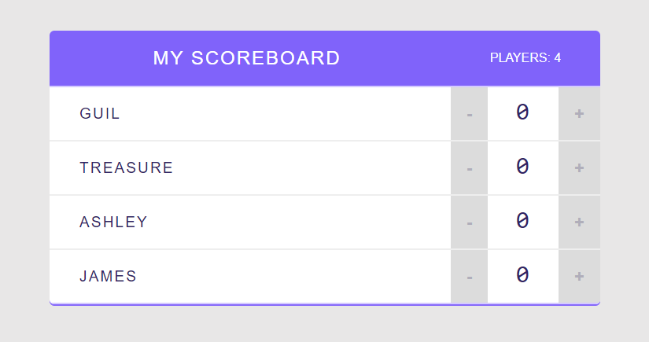

# React Player Scoreboard

This is a Scoreboard app built with React JS. React is a JavaScript library for building user interfaces. React makes building and maintaining the user interface of your application faster and easier by breaking it up into smaller, reusable components. It also helps eliminate the complexity that comes with updating your DOM elements when the user interacts with your application.

## Project Specifications

- Scoreboard tracks the number of players 
- Scoreboard tracks the name of players 
- Increment or Decrement the score by pressing the plus or negative signs
 
## Steps to execute this App:
- Download the entire code 
- Open up the index.html.
- [View Live Site](https://anthonys1760.github.io/ReactApp/)

## Technologies used: 
- HTML
- CSS
- React JS
- JSX
- Props
- State
- Components
- Events
